# "Основы Git"

## Gitlab. Добавление и просмотр удаленных репозиториев по протоколам SSH и HTTPS

<pre>
@smproskuryakov ➜ /workspaces/netology-devops (master) $ **git remote -v**
*origin  https://github.com/smproskuryakov/netology-devops (fetch)
origin  https://github.com/smproskuryakov/netology-devops (push)*

@smproskuryakov ➜ /workspaces/netology-devops (master) $ **git remote add gitlab https://gitlab.com/netology-devops-35/netology-devops.git**

@smproskuryakov ➜ /workspaces/netology-devops (master) $ **git remote -v**
*gitlab  https://gitlab.com/netology-devops-35/netology-devops.git (fetch)
gitlab  https://gitlab.com/netology-devops-35/netology-devops.git (push)
origin  https://github.com/smproskuryakov/netology-devops (fetch)
origin  https://github.com/smproskuryakov/netology-devops (push)*
@smproskuryakov ➜ /workspaces/netology-devops (master) $

@smproskuryakov ➜ /workspaces/netology-devops (master) $ **git remote -v**
*github-ssh      git@github.com:smproskuryakov/netology-devops.git (fetch)
github-ssh      git@github.com:smproskuryakov/netology-devops.git (push)
gitlab  https://gitlab.com/netology-devops-35/netology-devops.git (fetch)
gitlab  https://gitlab.com/netology-devops-35/netology-devops.git (push)
gitlab-ssh      git@gitlab.com:netology-devops-35/netology-devops.git (fetch)
gitlab-ssh      git@gitlab.com:netology-devops-35/netology-devops.git (push)
origin  https://github.com/smproskuryakov/netology-devops (fetch)
origin  https://github.com/smproskuryakov/netology-devops (push)*
@smproskuryakov ➜ /workspaces/netology-devops (master) $
</pre>

## Работа с IDE VS Code в графическом режиме ОС Windows, Linux shell и Codespaces

#### Запуск IDE, просмотр списка удаленных репозиториев

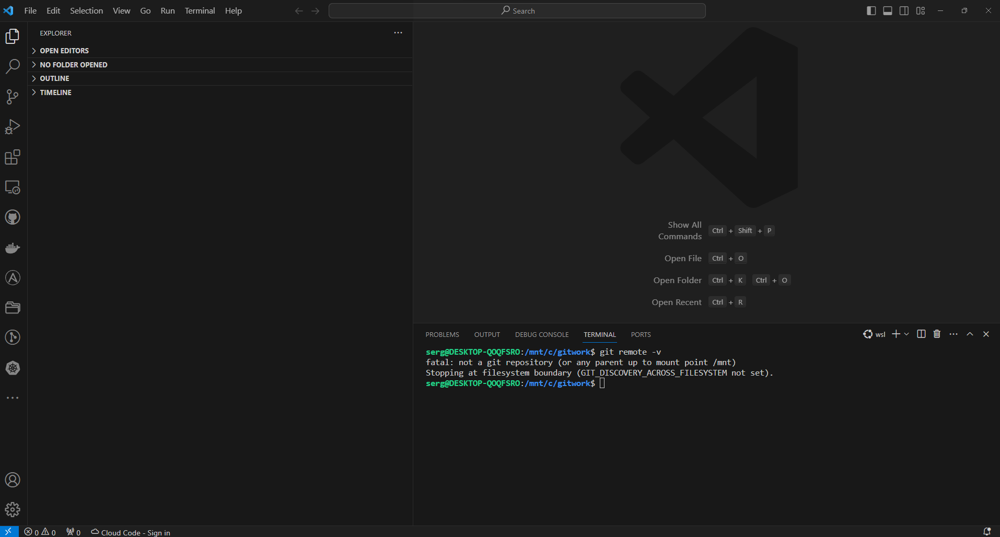

#### Создание репозитория в Gitlab

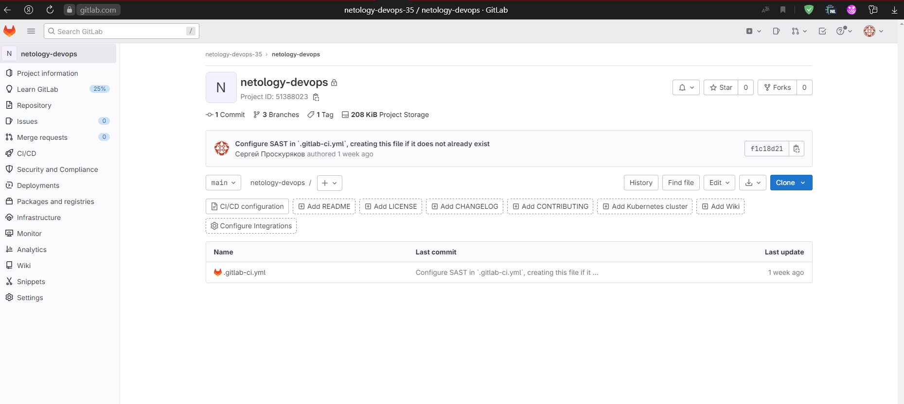

#### Тестовое выполнение команд git remote -v, git clone, git init, git remote add

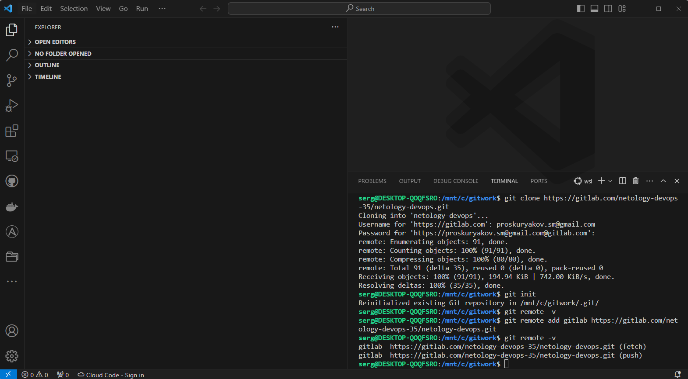

#### Переход в Codespaces

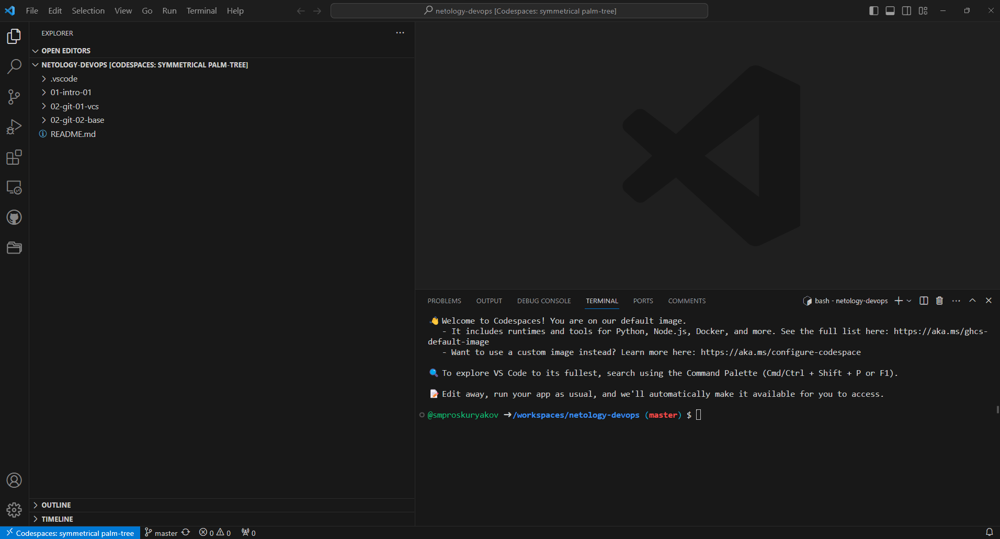

#### Редактирование файла README.md, попытка сохранения через графические средства IDE

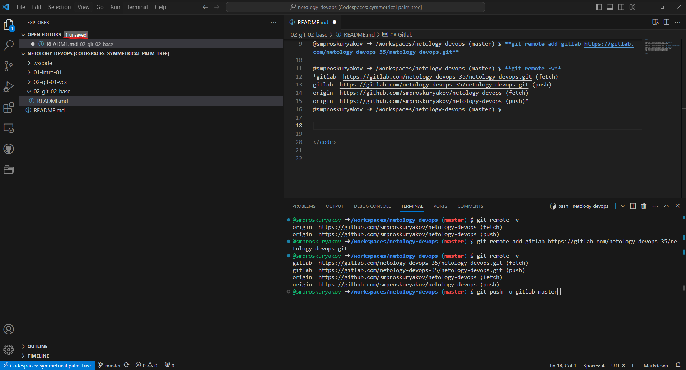

#### Commit & Push посредством IDE

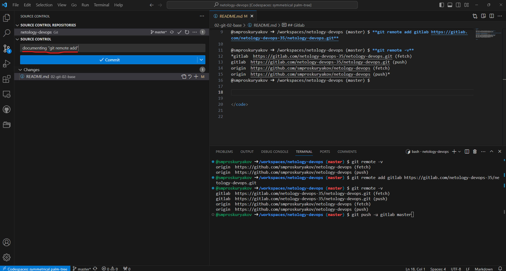

#### Просмотр активностей проекта в Gitlab

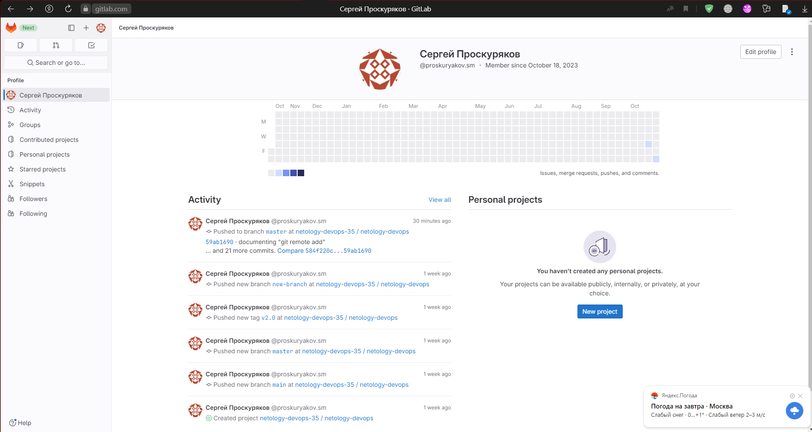

#### Просмотр списка удаленных репозиториев, выполнение git push посредством SSH

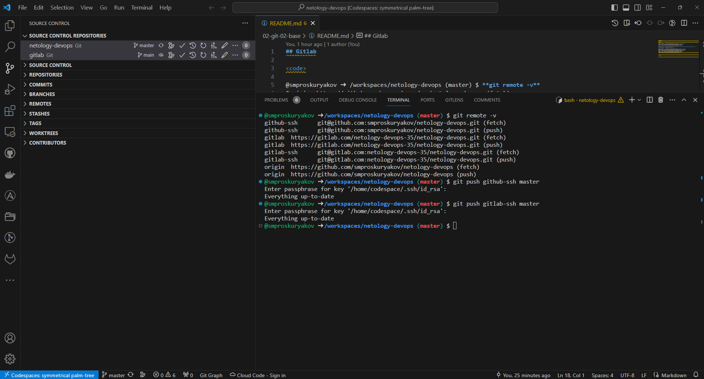

#### Клонирование репозитория origin в проект Gitlab

#### Просмотр коммитов и тегов в графическом режиме

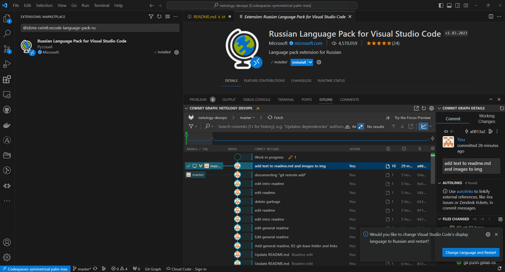

#### Работа через WEB-интерфейс Codespaces

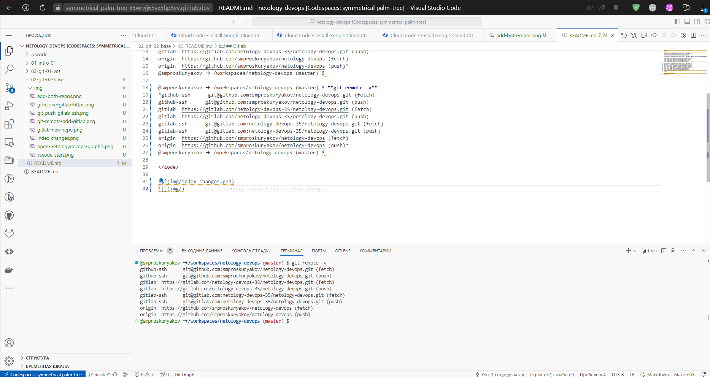

#### Работа с тегами

~~~
**git tag v0.0 HEAD** // Легековесный тег на HEAD-коммите

@smproskuryakov ➜ /workspaces/netology-devops (master) $ **git show v0.0**
commit 45861c2efa74d3fdb302cb64efe78652d91e50e5 (HEAD -> master, tag: v0.0, gitlab-ssh/master, github-ssh/master)
Author: smproskuryakov <139803641+smproskuryakov@users.noreply.github.com>
Date:   Sat Oct 28 17:20:29 2023 +0000

    edit readme

diff --git a/02-git-02-base/README.md b/02-git-02-base/README.md
index b0c010a..c912a81 100644
--- a/02-git-02-base/README.md
+++ b/02-git-02-base/README.md
@@ -31,17 +31,37 @@ origin  https://github.com/smproskuryakov/netology-devops (push)*

 ## Работа с IDE VS Code в графическом режиме ОС Windows, Linux shell и Codespaces

~~~

~~~
@smproskuryakov ➜ /workspaces/netology-devops (master) $ **git log --grep "First commit"**
commit 9bb3575b4748ff3579ffd8153ba999dc74b85dad
Author: smproskuryakov <smproskuryakov@yandex.ru>
Date:   Tue Oct 17 15:18:44 2023 +0300

    First commit

**git tag -a v0.2 -m "First commit" 9bb3575b4748ff3579ffd8153ba999dc74b85dad**

@smproskuryakov ➜ /workspaces/netology-devops (master) $ **git show v0.2**
tag v0.2
Tagger: smproskuryakov <139803641+smproskuryakov@users.noreply.github.com>
Date:   Sat Oct 28 17:46:34 2023 +0000

First commit

commit 9bb3575b4748ff3579ffd8153ba999dc74b85dad (tag: v0.2)
Author: smproskuryakov <smproskuryakov@yandex.ru>
Date:   Tue Oct 17 15:18:44 2023 +0300

    First commit

diff --git a/02-git-vcs/README.md b/02-git-vcs/README.md
new file mode 100644
index 0000000..e69de29
@smproskuryakov ➜ /workspaces/netology-devops (master) $
~~~

~~~
**git push origin <tag>
git push <remote> --tags**

@smproskuryakov ➜ /workspaces/netology-devops (master) $ **git push gitlab-ssh v0.0**
Enter passphrase for key '/home/codespace/.ssh/id_rsa':
Total 0 (delta 0), reused 0 (delta 0), pack-reused 0
To gitlab.com:netology-devops-35/netology-devops.git
 * [new tag]         v0.0 -> v0.0
@smproskuryakov ➜ /workspaces/netology-devops (master) $ **git push github-ssh v0.0**
Enter passphrase for key '/home/codespace/.ssh/id_rsa':
Total 0 (delta 0), reused 0 (delta 0), pack-reused 0
To github.com:smproskuryakov/netology-devops.git
 * [new tag]         v0.0 -> v0.0
@smproskuryakov ➜ /workspaces/netology-devops (master) $ **git push github-ssh --tags**
Enter passphrase for key '/home/codespace/.ssh/id_rsa':
Enumerating objects: 1, done.
Counting objects: 100% (1/1), done.
Writing objects: 100% (1/1), 180 bytes | 180.00 KiB/s, done.
Total 1 (delta 0), reused 0 (delta 0), pack-reused 0
To github.com:smproskuryakov/netology-devops.git
 * [new tag]         v0.2 -> v0.2
@smproskuryakov ➜ /workspaces/netology-devops (master) $ **git push gitlab-ssh --tags**
Enter passphrase for key '/home/codespace/.ssh/id_rsa':
Enumerating objects: 1, done.
Counting objects: 100% (1/1), done.
Writing objects: 100% (1/1), 180 bytes | 180.00 KiB/s, done.
Total 1 (delta 0), reused 0 (delta 0), pack-reused 0
To gitlab.com:netology-devops-35/netology-devops.git
 * [new tag]         v0.2 -> v0.2
@smproskuryakov ➜ /workspaces/netology-devops (master) $
~~~

#### Просмотр тегов в графическом режиме, удаление случайного тега "show"

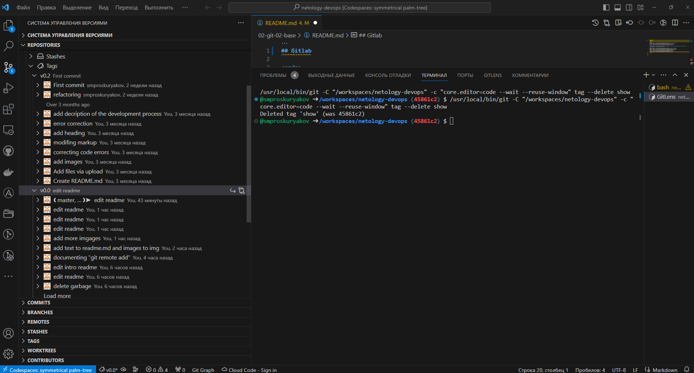

## Работа с историей коммитов и ветвлениями

