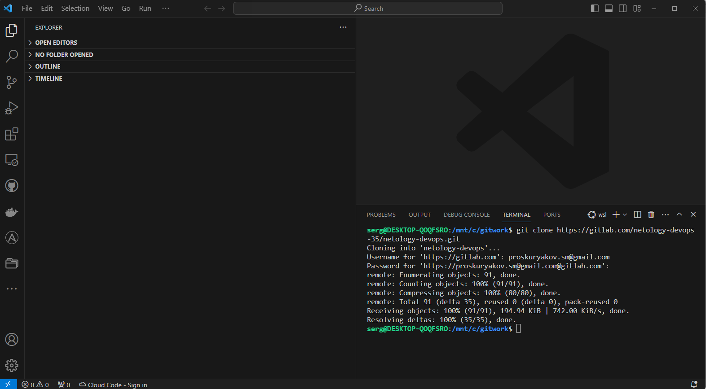

## Gitlab. Добавление и просмотр удаленных репозиториев по протоколам SSH и HTTPS

<code>

@smproskuryakov ➜ /workspaces/netology-devops (master) $ **git remote -v**
*origin  https://github.com/smproskuryakov/netology-devops (fetch)
origin  https://github.com/smproskuryakov/netology-devops (push)*

@smproskuryakov ➜ /workspaces/netology-devops (master) $ **git remote add gitlab https://gitlab.com/netology-devops-35/netology-devops.git**

@smproskuryakov ➜ /workspaces/netology-devops (master) $ **git remote -v**
*gitlab  https://gitlab.com/netology-devops-35/netology-devops.git (fetch)
gitlab  https://gitlab.com/netology-devops-35/netology-devops.git (push)
origin  https://github.com/smproskuryakov/netology-devops (fetch)
origin  https://github.com/smproskuryakov/netology-devops (push)*
@smproskuryakov ➜ /workspaces/netology-devops (master) $ 

@smproskuryakov ➜ /workspaces/netology-devops (master) $ **git remote -v**
*github-ssh      git@github.com:smproskuryakov/netology-devops.git (fetch)
github-ssh      git@github.com:smproskuryakov/netology-devops.git (push)
gitlab  https://gitlab.com/netology-devops-35/netology-devops.git (fetch)
gitlab  https://gitlab.com/netology-devops-35/netology-devops.git (push)
gitlab-ssh      git@gitlab.com:netology-devops-35/netology-devops.git (fetch)
gitlab-ssh      git@gitlab.com:netology-devops-35/netology-devops.git (push)
origin  https://github.com/smproskuryakov/netology-devops (fetch)
origin  https://github.com/smproskuryakov/netology-devops (push)*
@smproskuryakov ➜ /workspaces/netology-devops (master) $ 

</code>

## Работа с IDE VS Code в графическом режиме ОС Windows, Linux shell и Codespaces

