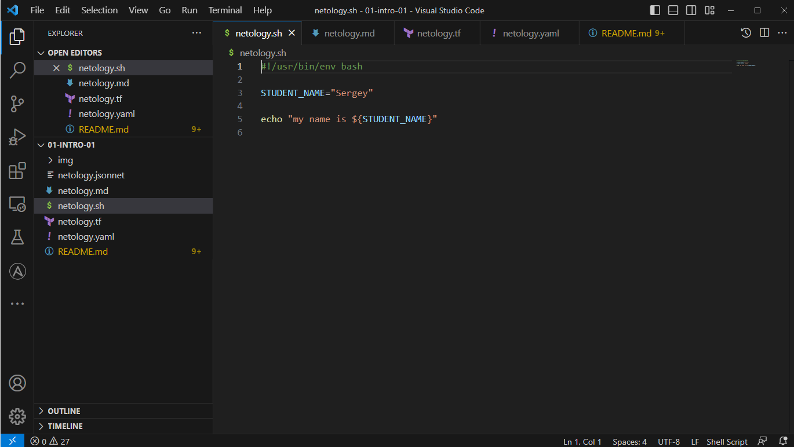
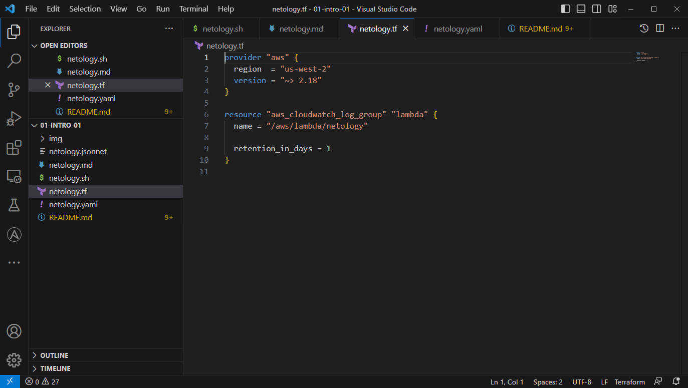

- 👋 Hi, I’m Sergey Proskuryakov
- 👀 I’m interested in Networking and DevOps
- 🌱 I’m currently learning everything that seems interesting to me
- 💞️ I’m looking to collaborate on not just now, a year later
- 📫 How to reach me: smproskuryakov@yandex.ru

1) 
2) 
3) 
4) 

<!---
smproskuryakov/smproskuryakov is a ✨ special ✨ repository because its `README.md` (this file) appears on your GitHub profile.
You can click the Preview link to take a look at your changes.
--->
